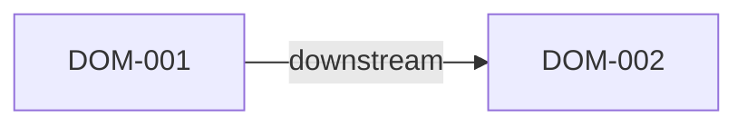

# Domain Map

Use this file to describe durable project domains, upstream or downstream dependencies, and related briefs that should be reviewed together.

## When To Fill This File

- The project is large enough to split work across multiple briefs
- Shared APIs, platforms, or workflows are reused by several design bundles
- Reviewers need a stable map of upstream and downstream impact

## Usage Rules

- Keep one entry per durable domain rather than per screen or endpoint
- Record upstream and downstream domains explicitly
- Add related brief IDs when a brief depends on or extends the domain
- Prefer stable domain names that survive multiple feature iterations
- Keep Mermaid node labels aligned with the `DOM-xxx` identifiers listed below

## Relationship Snapshot

## Domains

### DOM-001 <domain name>
- purpose: <what this domain owns>
- owns:
  - <module, API, or business capability>
- upstream_domains:
  - <domain id or `none`>
- downstream_domains:
  - <domain id or `none`>
- related_briefs:
  - <brief-id or `none`>
