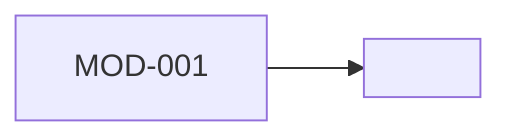

# Module Design

## Dependency Snapshot

## Module Boundaries

### MOD-001 <module name>
- responsibility: <responsibility>
- inputs:
  - <input>
- outputs:
  - <output>
- collaborators:
  - <module or service>
