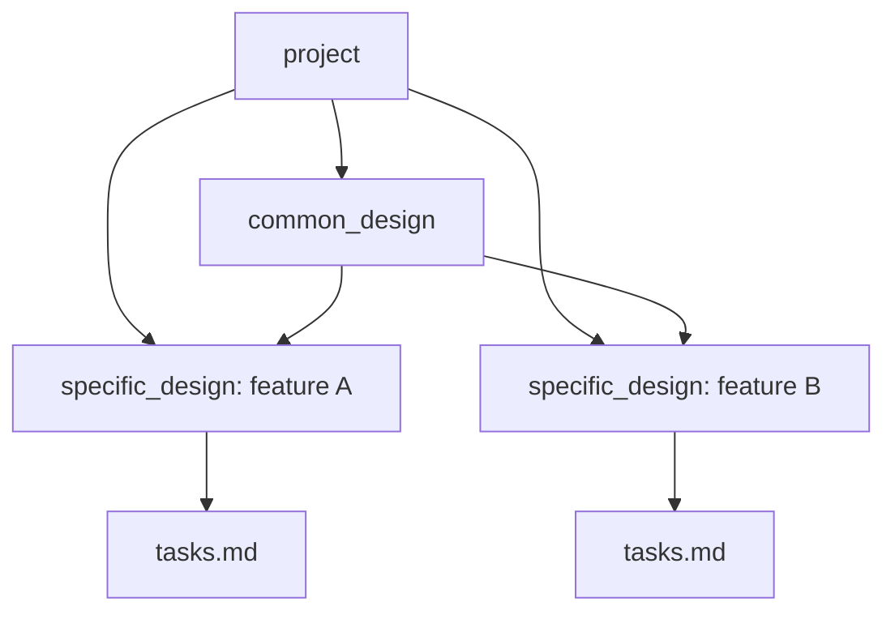

# SpecKit for Projects

[日本語版はこちら](README.ja.md)

`SpecKit for Projects` is a lightweight CLI plus scaffold bundle for design-driven development in SI-style projects. It keeps the executable surface area small and moves most document generation into AI workflows backed by repository-managed prompts, skills, and templates.

## Why This Exists

Many teams want design artifacts to be regenerable, reviewable, and consistent across features, but they do not want a large framework or a document generator that owns too much of the process.

`SpecKit for Projects` focuses on a narrower role:

- initialize a repository with the required scaffold
- install agent-facing prompts or skills for the AI tool you use
- validate that the repository still has the files needed for the workflow

It does not try to replace the actual design work. The `brief`, `common_design`, `specific_design`, `tasks`, and `implement` steps are driven by the prompts and skills that `sdd init` installs.

## Information Model

The workflow separates design truth into three layers:

- `project`: repository-wide standards and shared constraints
- `common_design`: shared API, data, module, and UI truth reused by multiple features
- `specific_design`: feature-specific design derived from one brief

The relationship between those design artifacts looks like this:



That split is the main guardrail. Shared truth lives once, and feature bundles reference it instead of copying it.

## Current CLI Scope

The CLI currently exposes three commands:

- `sdd init`
- `sdd check`
- `sdd analyze`

The rest of the workflow is executed through the installed agent prompts and skills:

- `sdd.brief`
- `sdd.analyze`
- `sdd.common-design`
- `sdd.design`
- `sdd.tasks`
- `sdd.implement`

Responsibility split:

- `sdd check`: validate scaffold, directory layout, agent command files, and runtime availability
- `sdd analyze`: validate one or more generated `specific_design` bundles and report consistency issues

## Installation

`SpecKit for Projects` requires Python 3.12 or later. [`uv`](https://docs.astral.sh/uv/) is the recommended workflow.

The distribution package name is `speckit-for-projects`. The CLI remains `sdd`, and the
internal Python module path is `speckit_for_projects`.

Run from source without installing globally:

```bash
uv sync --dev
uv run sdd --help
```

Install the local checkout as a CLI tool:

```bash
uv tool install --editable .
sdd --help
```

Install from a package index by name:

```bash
uv tool install speckit-for-projects
sdd --help
```

If you want to validate the example Storybook bundles, Node.js and npm are also required.

## Quick Start

Initialize the current repository for Codex:

```bash
sdd init --here --ai codex --ai-skills
sdd check --ai codex
```

Initialize a new directory:

```bash
sdd init my-project --ai claude
```

Initialize for a generic agent with a custom prompt directory:

```bash
sdd init --here --ai generic --ai-commands-dir .myagent/commands
sdd check --ai generic --ai-commands-dir .myagent/commands
```

After generating `designs/specific_design/<design-id>/tasks.md`, re-check the bundle:

```bash
sdd analyze <design-id>
```

## What Gets Generated

`sdd init` prepares a repository with:

- `.specify/project/*.md` for project-wide standards
- `.specify/glossary.md`
- `.specify/conventions/README.md`
- `.specify/templates/commands/*.md` for agent workflows
- `.specify/templates/artifacts/` for scaffolded deliverables
- `briefs/`
- `designs/common_design/`
- `designs/common_design/ui/`
- `designs/specific_design/`

Typical outputs later created through the workflow:

- `briefs/<brief-id>.md`
- `designs/common_design/api|data|module|ui/*.md`
- `designs/specific_design/<design-id>/overview.md`
- `designs/specific_design/<design-id>/common-design-refs.yaml`
- `designs/specific_design/<design-id>/traceability.yaml`
- `designs/specific_design/<design-id>/tasks.md`

## Standard Workflow

1. Run `sdd init`.
2. Run `sdd check`.
3. Fill `.specify/project/*.md` and `.specify/glossary.md`.
4. Generate one brief with `sdd.brief`.
5. Generate shared design only when multiple features depend on the same truth.
6. Generate one `specific_design` bundle from one brief.
7. Generate `tasks.md`.
8. Run `sdd analyze <design-id>` or `sdd analyze --all`.
9. Execute implementation work and update the execution ledger.
10. Review the resulting diff.

## `sdd init` Behavior

`sdd init` writes managed scaffold files only once by default.

- existing managed files are kept on re-run
- existing agent command files are kept on re-run
- existing skills are kept on re-run
- `--force` overwrites all of the above

If the target directory does not already contain `.git`, `sdd init` also tries to run `git init` unless `--no-git` is specified.

## `sdd check` Behavior

`sdd check` validates:

- the shared scaffold under `.specify/`
- required directories under `briefs/` and `designs/`
- agent-specific command files when `--ai` is specified
- required local CLI runtime availability as a warning for agents that need one

Exit codes:

- `0`: no warnings or failures
- `1`: warnings only
- `2`: one or more failures

## `sdd analyze` Behavior

`sdd analyze` validates generated bundle consistency under `designs/specific_design/`.

- `sdd analyze <design-id>`: analyze one bundle by ID
- `sdd analyze designs/specific_design/<design-id>`: analyze one bundle by path
- `sdd analyze --all`: analyze every bundle under `designs/specific_design/`

It checks:

- required files inside the bundle
- `traceability.yaml` structure and references
- `tasks.md` requirement coverage
- `common-design-refs.yaml` structure and resolvability
- brief-to-bundle requirement and shared design alignment when the matching brief exists

Exit codes:

- `0`: all analyzed bundles are valid
- `2`: one or more analyzed bundles have issues, or the input is invalid

## Repository Layout

```text
.specify/
├── glossary.md
├── conventions/
├── project/
│   ├── tech-stack.md
│   ├── domain-map.md
│   ├── coding-rules.md
│   └── architecture-principles.md
└── templates/
    ├── commands/
    │   ├── analyze.md
    │   ├── brief.md
    │   ├── common-design.md
    │   ├── design.md
    │   ├── tasks.md
    │   └── implement.md
    └── artifacts/
        ├── brief.md
        ├── common_design/
        └── design/
briefs/
designs/
├── common_design/
│   ├── api/
│   ├── data/
│   ├── module/
│   └── ui/
└── specific_design/
    └── 001-example/
```

## This Repository's Own Structure

The package source of truth and the repository's working files are not the same thing.

- `src/speckit_for_projects/`: CLI implementation and validation logic
- `src/speckit_for_projects/templates/`: Jinja source templates used by `sdd init`
- `guides/`: end-user documentation for operating the workflow
- `docs/`: maintainer and implementation notes for this repository itself
- `examples/`: sample outputs and project-standard examples
- `tests/`: unit, integration, golden, and end-to-end coverage
- `.specify/`: this repository's own initialized scaffold used for dogfooding
- `.codex/` and `.myagent/`: locally generated agent prompt outputs in this repository

Important detail: checked-in skills are not the source of truth. Skills are generated from the shared command templates under `.specify/templates/commands/` or, if needed, directly from `src/speckit_for_projects/templates/commands/*.j2`.

Also note that some templates exist in `src/speckit_for_projects/templates/` but are not currently installed by `sdd init`. In the current implementation that includes:

- `src/speckit_for_projects/templates/project/design-system.md.j2`
- `src/speckit_for_projects/templates/project/ui-storybook/*`
- legacy specific-design templates such as `api-design.md.j2`, `data-design.md.j2`, and `module-design.md.j2`

Those files exist in the source tree, but they are not part of the managed scaffold written by the current CLI.

## Examples And Guides

- [examples/README.md](examples/README.md)
- [guides/manual.ja.md](guides/manual.ja.md)
- [guides/tutorial.ja.md](guides/tutorial.ja.md)
- [guides/cli-reference.ja.md](guides/cli-reference.ja.md)
- [guides/workflow-reference.ja.md](guides/workflow-reference.ja.md)
- [guides/artifact-reference.ja.md](guides/artifact-reference.ja.md)
- [guides/troubleshooting.ja.md](guides/troubleshooting.ja.md)

## Supported AI Agents

Current supported `--ai` values are:

- `agy`
- `amp`
- `auggie`
- `bob`
- `claude`
- `codebuddy`
- `codex`
- `copilot`
- `cursor-agent`
- `gemini`
- `generic`
- `kilocode`
- `kiro-cli`
- `opencode`
- `qodercli`
- `qwen`
- `roo`
- `shai`
- `vibe`
- `windsurf`

Alias:

- `kiro` resolves to `kiro-cli`

Typical command output locations:

- `codex`: `.codex/prompts/`
- `claude`: `.claude/commands/`
- `gemini`: `.gemini/commands/`
- `copilot`: `.github/agents/`
- `cursor-agent`: `.cursor/commands/`
- `kiro-cli`: `.kiro/prompts/`
- `generic`: the path passed to `--ai-commands-dir`

Skill output locations:

- `codex`: `.agents/skills/`
- most other named agents: `<agent-folder>/skills/`

Codex note:

- `.codex/prompts/*.md` are saved prompts, not registered slash commands
- `--ai-skills` adds Codex-discoverable skills under `.agents/skills/`

Skill implementation note:

- there is no separate per-skill source tree in `src/`
- generated `SKILL.md` files are wrapped from the shared command templates

## Development

Recommended local checks:

```bash
uv run pytest
uv run ruff check .
uv run mypy src
```

Example Storybook bundles can be verified with:

```bash
cd examples/screen-centric/designs/specific_design/001-screened-application-portal/ui-storybook
npm install
npm run build-storybook
```

## OSS Documentation

- [LICENSE](LICENSE)
- [CONTRIBUTING.md](CONTRIBUTING.md)
- [CODE_OF_CONDUCT.md](CODE_OF_CONDUCT.md)
- [SECURITY.md](SECURITY.md)
