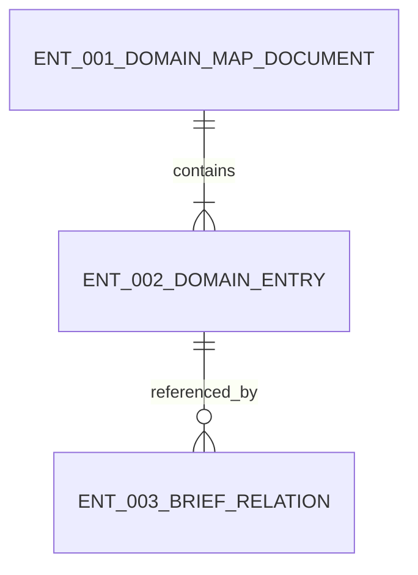

# Data Design

## Entity Relationship Snapshot

## Entities

### ENT-001 DomainMapDocument
- purpose: Represent the repository-wide domain relationship source used by generation workflows.
- fields:
  - name: version
    type: string
    required: false
  - name: domains
    type: list<DomainEntry>
    required: true
  - name: usage_rules
    type: list<string>
    required: false
- relationships:
  - contains ENT-002 DomainEntry records

### ENT-002 DomainEntry
- purpose: Describe one durable project domain and its declared dependencies.
- fields:
  - name: domain_id
    type: string
    required: true
  - name: name
    type: string
    required: true
  - name: purpose
    type: string
    required: true
  - name: owns
    type: list<string>
    required: true
  - name: upstream_domains
    type: list<string>
    required: true
  - name: downstream_domains
    type: list<string>
    required: true
  - name: related_briefs
    type: list<string>
    required: false
- relationships:
  - referenced by ENT-003 BriefRelation

### ENT-003 BriefRelation
- purpose: Capture the relationship between a generated brief and the domains or briefs it depends on.
- fields:
  - name: source_brief_id
    type: string
    required: true
  - name: target_domain_id
    type: string
    required: true
  - name: target_brief_id
    type: string
    required: false
  - name: relation_type
    type: string
    required: true
  - name: rationale
    type: string
    required: true
- relationships:
  - links briefs to ENT-002 DomainEntry
