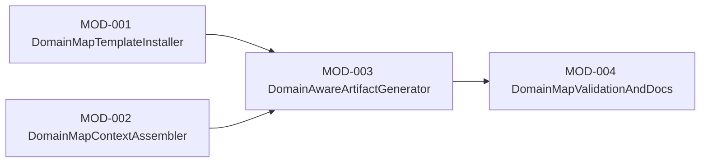

# Module Design

## Dependency Snapshot

## Module Boundaries

### MOD-001 DomainMapTemplateInstaller
- responsibility: Install the managed `domain-map.md` scaffold and register it as part of the shared project standard set.
- inputs:
  - project initialization options
  - managed template files
- outputs:
  - `.specify/project/domain-map.md`
  - updated scaffold manifest and golden expectations
- collaborators:
  - ProjectInitializer
  - agent template installers

### MOD-002 DomainMapContextAssembler
- responsibility: Read and normalize `domain-map.md` when present so brief, design, and task commands can use a common structure.
- inputs:
  - `.specify/project/domain-map.md`
  - selected brief or design target
- outputs:
  - resolved domain metadata
  - related brief references
- collaborators:
  - context assembly helpers
  - YAML or markdown loaders

### MOD-003 DomainAwareArtifactGenerator
- responsibility: Extend brief and design command templates plus artifact templates so generated outputs persist domain alignment and review dependencies.
- inputs:
  - command templates
  - artifact templates
  - domain map context
- outputs:
  - domain-aware brief sections
  - domain-aware design sections
  - task assumptions referencing related briefs
- collaborators:
  - brief workflow
  - design workflow
  - tasks workflow

### MOD-004 DomainMapValidationAndDocs
- responsibility: Update checks, examples, and regression coverage so repositories can adopt the feature safely.
- inputs:
  - scaffold validation rules
  - example project fixtures
  - README and golden files
- outputs:
  - passing validation rules
  - updated examples and documentation
- collaborators:
  - ConsistencyChecker
  - test suite
  - README maintainers
