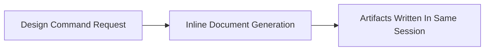

# Batch Design

## Execution Snapshot

## Batch And Async Responsibilities

- applicable: no
- trigger: not applicable
- purpose: Domain map support is resolved during document generation and does not require batch or async processing.
- dependencies:
  - none
