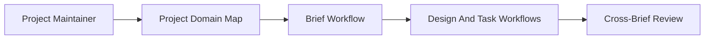

# Overview

- brief_id: 001-project-domain-map-support
- design_id: 001-project-domain-map-support

## Goal
Extend the scaffold so a shared project domain map can guide brief splitting, related brief references, and downstream design/task generation without breaking existing repositories.

## Scope
- Add a managed `.specify/project/domain-map.md` template and usage guidance
- Load domain map context when running brief, design, and task workflows
- Extend generated artifacts with domain alignment and related brief references
- Preserve no-op behavior when the domain map file is absent
- Add documentation, examples, and regression coverage for the feature

## Domain Context
- primary_domain: DOM-001 Shared Project Standards
- related_briefs:
  - none
- upstream_domains:
  - none
- downstream_domains:
  - DOM-010 Brief Workflow
  - DOM-020 Design Workflow
  - DOM-030 Task Workflow

## Flow Snapshot

## Primary Flow
1. A project maintainer updates `.specify/project/domain-map.md` with durable domains, dependencies, and known related briefs.
2. The AI agent runs the brief workflow and reads the domain map alongside the existing shared project standards.
3. The generated brief records which domain the feature belongs to and which briefs are related or impacted.
4. The AI agent runs the design and task workflows, which propagate the same domain context into design boundaries, review assumptions, and implementation notes.
5. Reviewers use the generated bundle to understand cross-brief dependencies before approving implementation work.

## Non-Goals
- Auto-generating a complete enterprise architecture graph
- Inferring domain dependencies without curated project input
- Replacing detailed API, data, module, or test design with only the domain map
