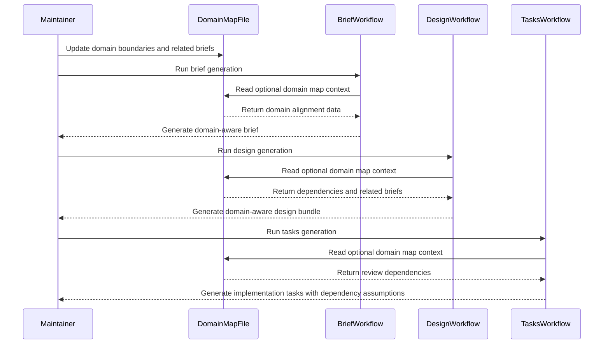

# Sequence Flow: Core Flow

- sequence_id: SEQ-001
- requirement_ids:
  - REQ-002
  - REQ-003
  - REQ-004

```mermaid
sequenceDiagram
    participant Maintainer
    participant DomainMap as DomainMapFile
    participant BriefFlow as BriefWorkflow
    participant DesignFlow as DesignWorkflow
    participant TasksFlow as TasksWorkflow
    Maintainer->>DomainMap: Update domain boundaries and related briefs
    Maintainer->>BriefFlow: Run brief generation
    BriefFlow->>DomainMap: Read optional domain map context
    DomainMap-->>BriefFlow: Return domain alignment data
    BriefFlow-->>Maintainer: Generate domain-aware brief
    Maintainer->>DesignFlow: Run design generation
    DesignFlow->>DomainMap: Read optional domain map context
    DomainMap-->>DesignFlow: Return dependencies and related briefs
    DesignFlow-->>Maintainer: Generate domain-aware design bundle
    Maintainer->>TasksFlow: Run tasks generation
    TasksFlow->>DomainMap: Read optional domain map context
    DomainMap-->>TasksFlow: Return review dependencies
    TasksFlow-->>Maintainer: Generate implementation tasks with dependency assumptions
```
