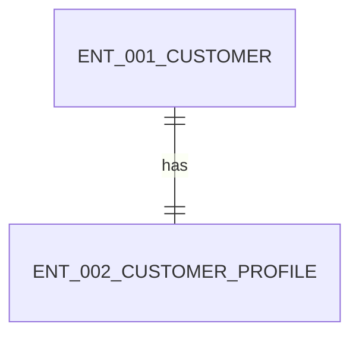

# Data Design

## Entity Relationship Snapshot

## Entities

### ENT-001 Customer
- purpose: Represent the partner-facing customer profile.
- fields:
  - name: customer_id
    type: string
    required: true
  - name: external_customer_id
    type: string
    required: true
- relationships:
  - has one profile

### ENT-002 CustomerProfile
- purpose: Store the normalized profile payload returned to partner systems.
- fields:
  - name: customer_id
    type: string
    required: true
  - name: display_name
    type: string
    required: true
- relationships:
  - belongs to ENT-001 Customer
