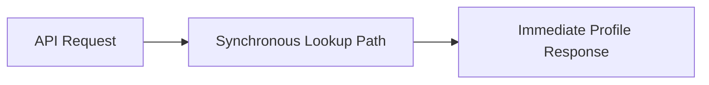

# Batch Design

## Execution Snapshot

```mermaid
flowchart LR
    REQUEST["API Request"] --> INLINE["Synchronous Lookup Path"]
    INLINE --> RESPONSE["Immediate Profile Response"]
```

## Batch And Async Responsibilities

- applicable: no
- trigger: none
- purpose: No batch processing is needed for lookup-only API
- dependencies:
  - none
