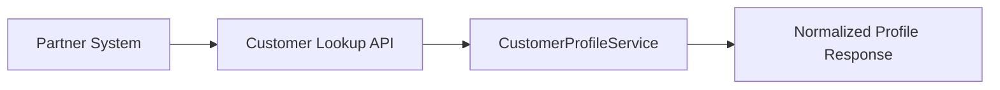

# Overview

- brief_id: 001-customer-api-modernization
- design_id: 001-customer-api-modernization

## Goal
Provide a stable profile retrieval API for partner systems.

## Scope
- Lookup endpoint
- Contract normalization

## Domain Context
- primary_domain: none
- related_briefs:
  - none
- upstream_domains:
  - none
- downstream_domains:
  - none

## Flow Snapshot

## Primary Flow
1. Partner sends an identifier.
2. API resolves the customer profile.
3. Profile response is returned.

## Non-Goals
- UI delivery
