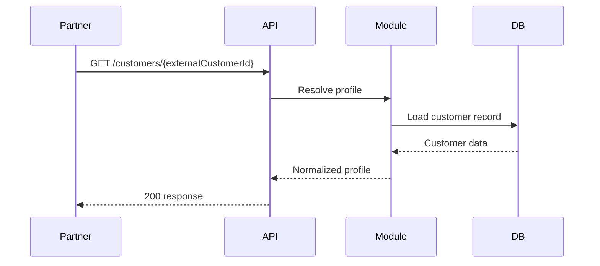

# Sequence Flow: Customer Profile Lookup

- sequence_id: SEQ-001
- requirement_ids:
  - REQ-001

```mermaid
sequenceDiagram
    participant Partner
    participant API
    participant Module
    participant DB
    Partner->>API: GET /customers/{externalCustomerId}
    API->>Module: Resolve profile
    Module->>DB: Load customer record
    DB-->>Module: Customer data
    Module-->>API: Normalized profile
    API-->>Partner: 200 response
```
