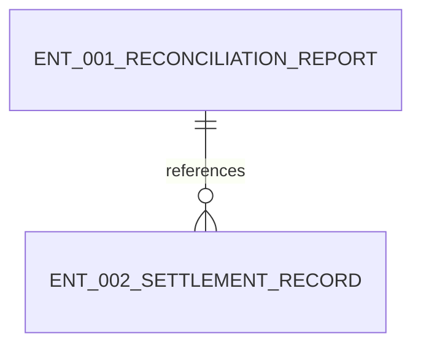

# Data Design

## Entity Relationship Snapshot

## Entities

### ENT-001 ReconciliationReport
- purpose: Store the result of nightly reconciliation.
- fields:
  - name: report_generated_at
    type: datetime
    required: true
  - name: mismatch_count
    type: integer
    required: true
- relationships:
  - references settlement records

### ENT-002 SettlementRecord
- purpose: Represent one imported settlement line used during reconciliation.
- fields:
  - name: settlement_record_id
    type: string
    required: true
  - name: amount
    type: decimal
    required: true
- relationships:
  - grouped into ENT-001 ReconciliationReport
