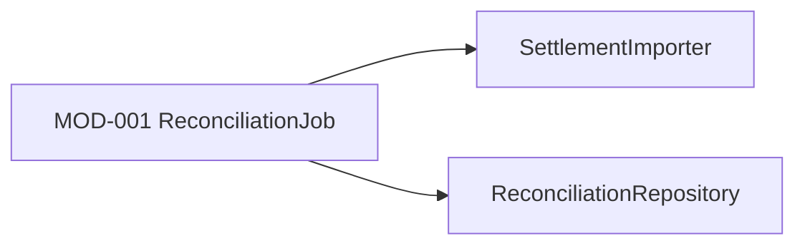

# Module Design

## Dependency Snapshot

## Module Boundaries

### MOD-001 ReconciliationJob
- responsibility: Orchestrate file import and reconciliation
- inputs:
  - settlement_file
- outputs:
  - reconciliation_report
- collaborators:
  - SettlementImporter
  - ReconciliationRepository
