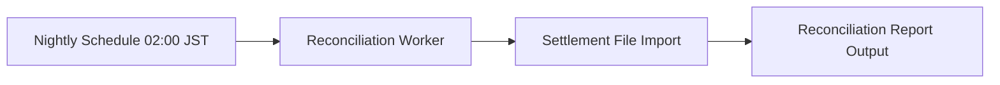

# Batch Design

## Execution Snapshot

## Batch And Async Responsibilities

- applicable: yes
- trigger: nightly schedule at 02:00 JST
- purpose: Import settlement file and reconcile transactions
- dependencies:
  - External settlement file delivery
