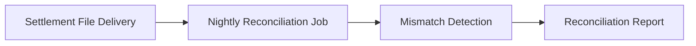

# Overview

- brief_id: 001-nightly-reconciliation
- design_id: 001-nightly-reconciliation

## Goal
Automate nightly reconciliation and reporting.

## Scope
- Settlement file import
- Mismatch report generation

## Domain Context
- primary_domain: none
- related_briefs:
  - none
- upstream_domains:
  - none
- downstream_domains:
  - none

## Flow Snapshot

## Primary Flow
1. Settlement file arrives.
2. Batch imports the file.
3. System reconciles totals and emits a report.

## Non-Goals
- Online real-time monitoring
