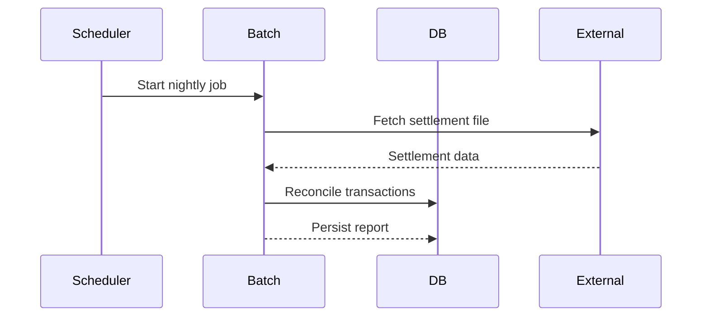

# Sequence Flow: Nightly Reconciliation

- sequence_id: SEQ-001
- requirement_ids:
  - REQ-001

```mermaid
sequenceDiagram
    participant Scheduler
    participant Batch
    participant DB
    participant External
    Scheduler->>Batch: Start nightly job
    Batch->>External: Fetch settlement file
    External-->>Batch: Settlement data
    Batch->>DB: Reconcile transactions
    Batch-->>DB: Persist report
```
