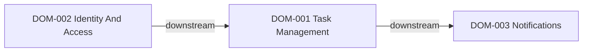

# Domain Map

このファイルは、複数 brief をまたぐ durable な業務ドメインと依存関係を記述するために使う。

## Usage Rules

- 画面単位や endpoint 単位ではなく、持続的な責務境界ごとに 1 エントリを置く。
- upstream と downstream のドメインを明示する。
- ある brief がそのドメインを変更または利用する場合は related brief を記録する。
- 一時的な施策名ではなく、繰り返し使える安定したドメイン名を採用する。
- Mermaid のノード名は下の `DOM-xxx` 識別子と揃える。

## Relationship Snapshot

## Domains

### DOM-001 Task Management
- purpose: task の CRUD、状態遷移、一覧表示の振る舞いを所有する。
- owns:
  - task 作成
  - task 更新
  - task 完了
  - task フィルタ
- upstream_domains:
  - DOM-002
- downstream_domains:
  - DOM-003
- related_briefs:
  - 001-task-inbox

### DOM-002 Identity And Access
- purpose: ユーザー認証、session 状態、ユーザー単位のデータ分離を所有する。
- owns:
  - sign-in flow
  - session validation
  - user scoping
- upstream_domains:
  - none
- downstream_domains:
  - DOM-001
- related_briefs:
  - 002-auth-foundation

### DOM-003 Notifications
- purpose: task reminder を有効化したときの通知スケジューリングと配信連携を所有する。
- owns:
  - reminder scheduling
  - notification delivery
  - outbound provider adapters
- upstream_domains:
  - DOM-001
- downstream_domains:
  - none
- related_briefs:
  - 003-task-reminders
