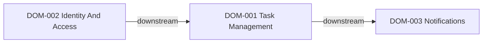

# Domain Map

Use this file to describe durable project domains, upstream or downstream dependencies, and related briefs that should be reviewed together.

## Usage Rules

- Keep one entry per durable domain rather than per screen or endpoint.
- Record upstream and downstream domains explicitly.
- Add related brief IDs when a brief depends on or extends the domain.
- Prefer stable domain names that survive multiple feature iterations.
- Keep Mermaid node labels aligned with the `DOM-xxx` identifiers listed below.

## Relationship Snapshot

## Domains

### DOM-001 Task Management
- purpose: Own task CRUD, task state transitions, and task list presentation behavior.
- owns:
  - task creation
  - task update
  - task completion
  - task filtering
- upstream_domains:
  - DOM-002
- downstream_domains:
  - DOM-003
- related_briefs:
  - 001-task-inbox

### DOM-002 Identity And Access
- purpose: Own user authentication, session state, and per-user data isolation.
- owns:
  - sign-in flow
  - session validation
  - user scoping
- upstream_domains:
  - none
- downstream_domains:
  - DOM-001
- related_briefs:
  - 002-auth-foundation

### DOM-003 Notifications
- purpose: Own reminder delivery and outbound notification integration when task reminders are enabled.
- owns:
  - reminder scheduling
  - notification delivery
  - outbound provider adapters
- upstream_domains:
  - DOM-001
- downstream_domains:
  - none
- related_briefs:
  - 003-task-reminders
