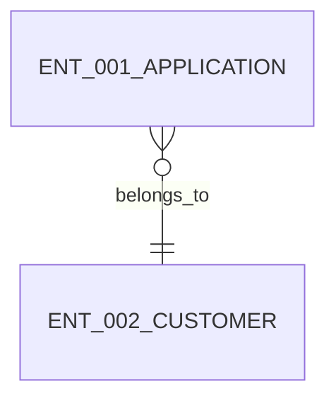

# Data Design

## Entity Relationship Snapshot

## Entities

### ENT-001 Application
- purpose: Store the review target application.
- fields:
  - name: application_id
    type: string
    required: true
  - name: applicant_name
    type: string
    required: true
- relationships:
  - belongs to customer

### ENT-002 Customer
- purpose: Represent the customer associated with the application under review.
- fields:
  - name: customer_id
    type: string
    required: true
  - name: customer_name
    type: string
    required: true
- relationships:
  - owns ENT-001 Application records
