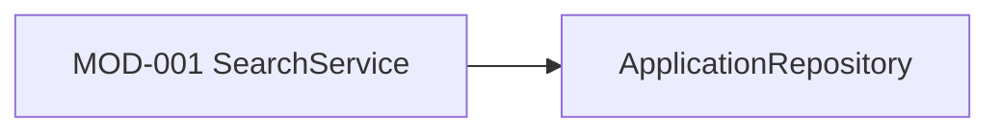

# Module Design

## Dependency Snapshot

## Module Boundaries

### MOD-001 SearchService
- responsibility: Validate criteria and coordinate API search
- inputs:
  - applicant_name
- outputs:
  - application_list
- collaborators:
  - ApplicationRepository
