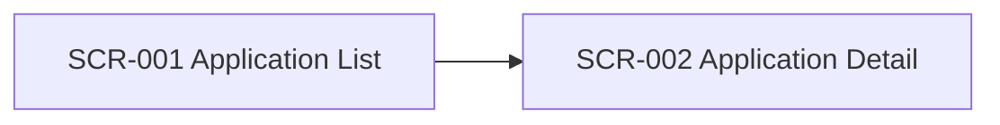

# Shared UI Screen Catalog

- common_design_id: CD-UI-001
- kind: ui
- artifact_type: screen_catalog

## Shared Purpose
Provide a stable catalog of back-office review screens used by multiple features.

## Screen Map

## Screens

### SCR-001 Application List
- purpose: Search and review submitted applications
- actors:
  - operations_staff
- entry_points:
  - global_navigation
- exits:
  - SCR-002
- permissions:
  - application.read
- notes:
  - Shared search entry point for review workflows

### SCR-002 Application Detail
- purpose: Review one application in detail
- actors:
  - operations_staff
- entry_points:
  - SCR-001
- exits:
  - SCR-001
- permissions:
  - application.read
- notes:
  - Shared detail view for review workflows

## Downstream Usage
- 001-screened-application-portal
