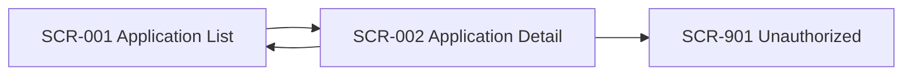

# Shared UI Navigation Rules

- common_design_id: CD-UI-002
- kind: ui
- artifact_type: navigation_rules

## Shared Purpose
Provide stable navigation rules for back-office review screens that recur across multiple features.

## Navigation Map

## Rules
- list_to_detail: `SCR-001` transitions to `SCR-002`
- detail_to_list: returning from `SCR-002` goes back to `SCR-001`
- save_complete: edits that complete on a review child screen return to `SCR-002`
- unauthorized: permission failures transition to `SCR-901`
- session_timeout: session timeout transitions to the login screen
- fatal_error: unrecoverable errors transition to the standard error screen

## Exceptions
- none

## Downstream Usage
- 001-screened-application-portal
