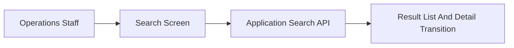

# Overview

- brief_id: 001-screened-application-portal
- design_id: 001-screened-application-portal

## Goal
Deliver a review UI for operations staff.

## Scope
- Search screen
- Detail transition

## Domain Context
- primary_domain: none
- related_briefs:
  - none
- upstream_domains:
  - none
- downstream_domains:
  - none

## Flow Snapshot

## Primary Flow
1. User enters search conditions.
2. System queries application data.
3. Results are shown and users can open details.

## Non-Goals
- Approval workflow redesign
